# Olympics Data Analysis Project

This project is based upon a historical dataset on the modern Olympic Games, including all the Games from Athens 1896 to Rio 2016. Total 120 years of data is available here.

Now the data is divided into two parts, summer olympics and winter olympics. I've done this project particularly on summer olympics.

## Features:
Total of 4 different analysis I've done on this project: Medal Tally, Overall Analysis, Country-wise Analysis, Athlete-wise Analysis. If you go in each section, you can customize the dashboards and check whatever you want.

- Medal Tally
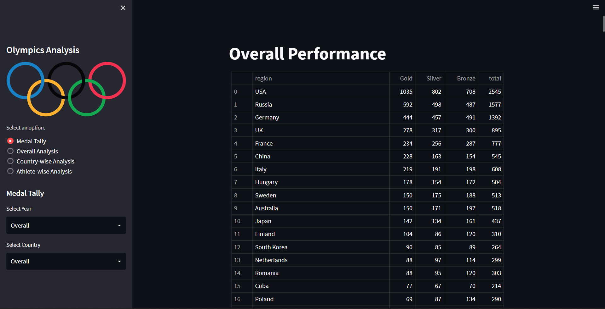

- Overall Analysis: Top Statistics
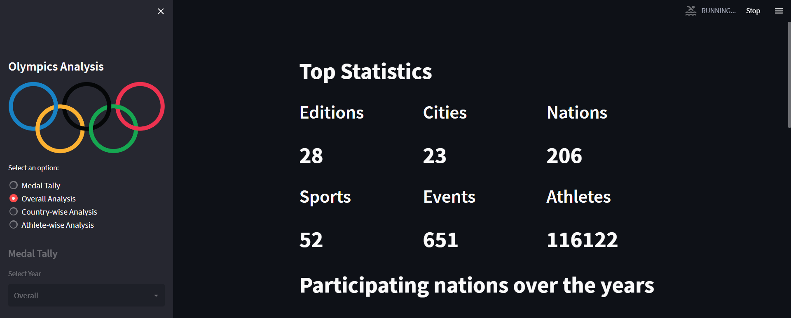

- Overall Analysis: Participating Nations Over Time
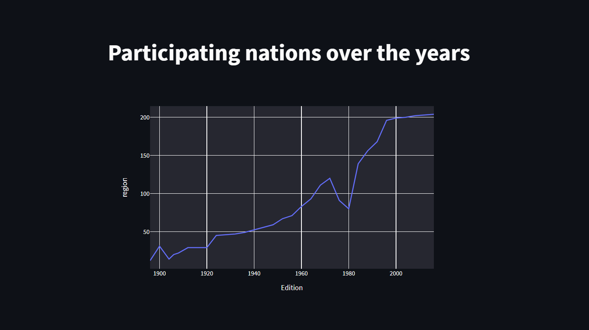

- Overall Analysis: No of Events Over Time

- Overall Analysis: Most Successful Athletes
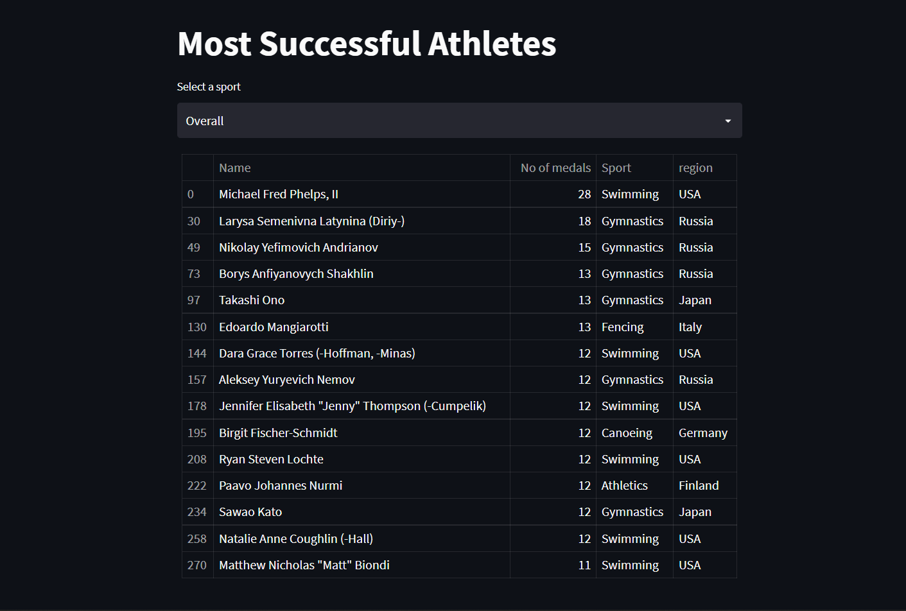

- Country-wise Analysis: Medal Tally Over Time for a Country
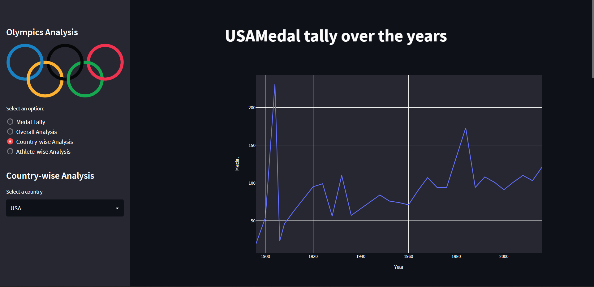

- Country-wise Analysis: Performance of Different Country in Different Sports & Events
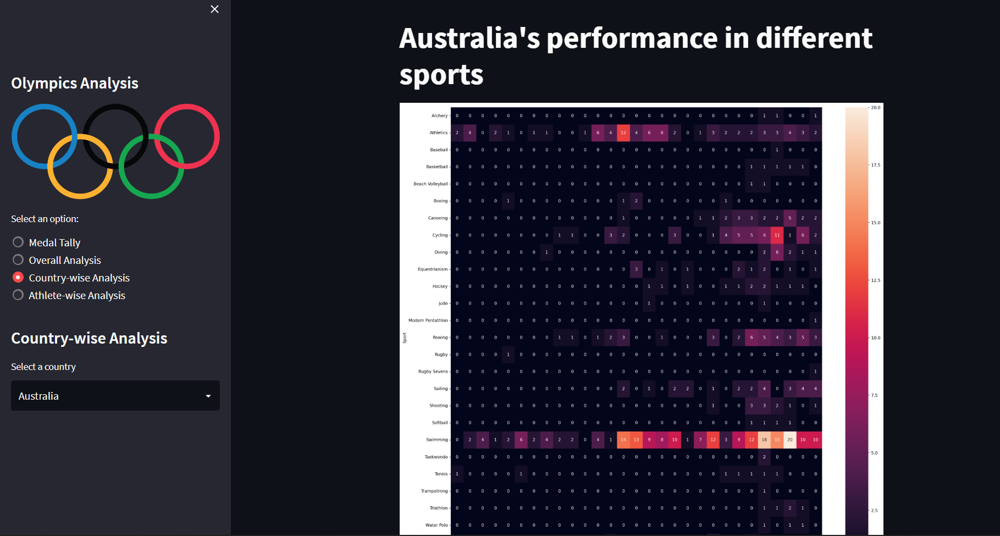

- Country-wise Analysis: Top 10 Athletes of a Country
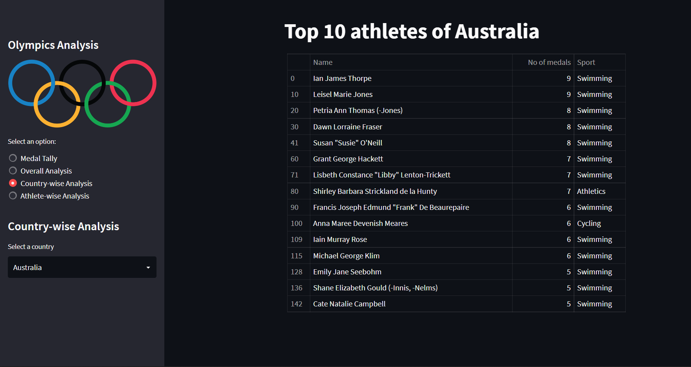

- Athlete-wise Analysis: Probability Distribution of Age vs Medals
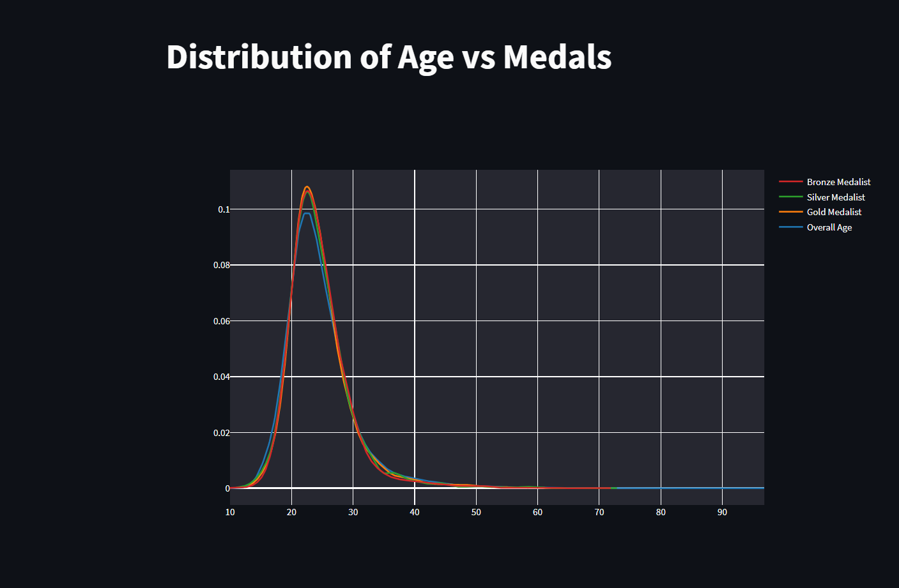

- Athlete-wise Analysis: Probability Distribution of Age vs Sports
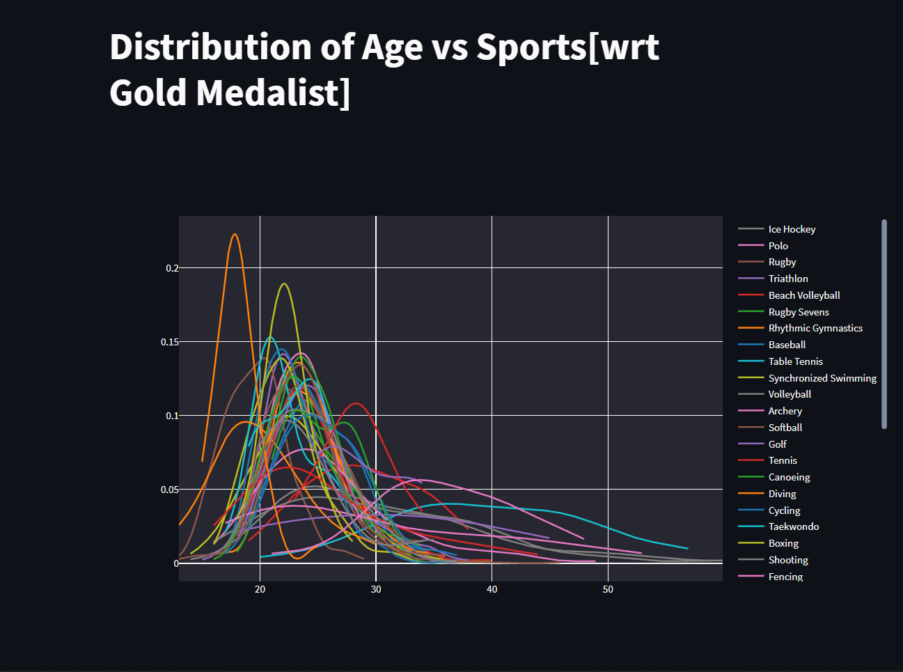

- Athlete-wise Analysis: Height vs Weight
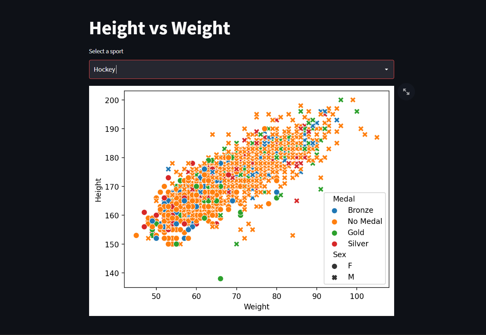

- Athlete-wise Analysis: Men vs Women
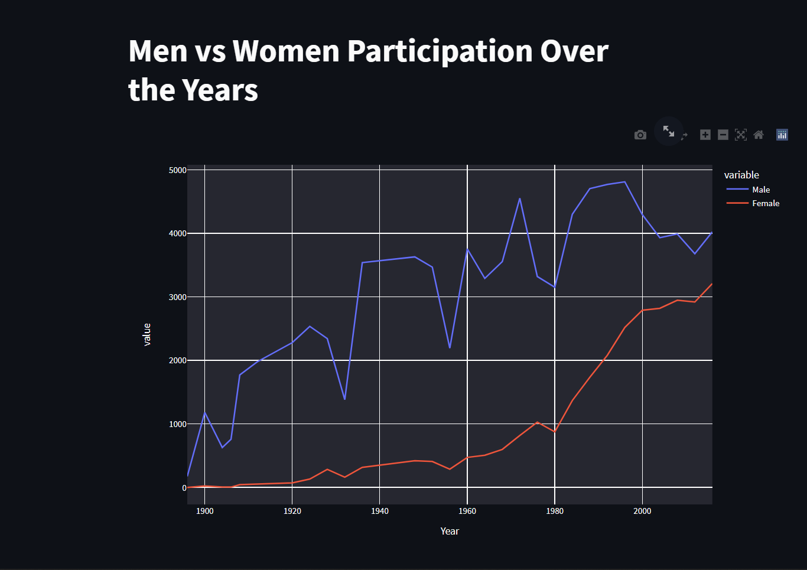

There are 2 datasets in this project: athlete-events.csv and noc_regions.csv.

The file athlete_events.csv contains 271116 rows and 15 columns. Each row corresponds to an individual athlete competing in an individual Olympic event (athlete-events). The columns are:

1. ID - Unique number for each athlete
2. Name - Athlete's name
3. Sex - M or F
4. Age - Integer
5. Height - In centimeters
6. Weight - In kilograms
7. Team - Team name
8. NOC - National Olympic Committee 3-letter code
9. Games - Year and season
10. Year - Integer
11. Season - Summer or Winter
12. City - Host city
13. Sport - Sport
14. Event - Event
15. Medal - Gold, Silver, Bronze, or NA

While the other dataset has only 3 columns:

1. NOC - National Olympic Committee 3-letter code
2. region - Player's origin
3. Notes - Other details about the region column

You can get the dataset from here: https://www.kaggle.com/datasets/heesoo37/120-years-of-olympic-history-athletes-and-results?select=noc_regions.csv

Please give some feedback about what are the things I could have done better or anything you want to say. And thank you!